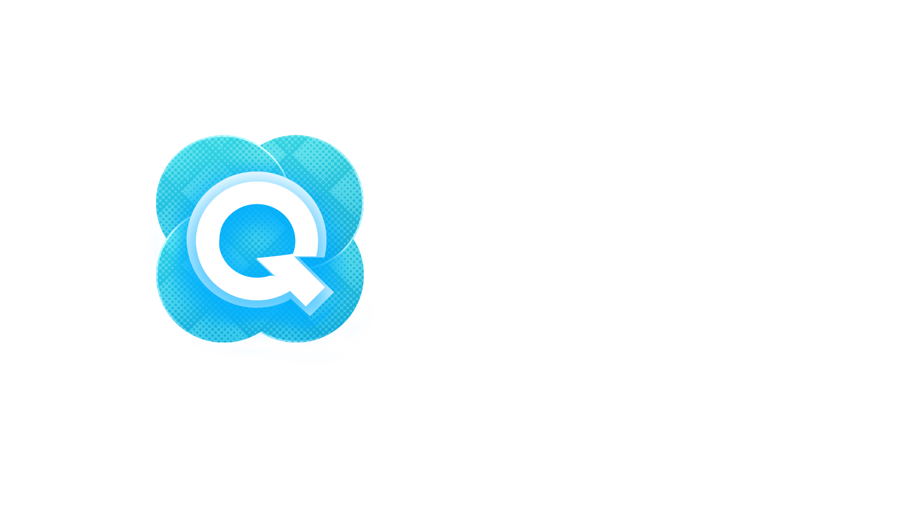

# Quasar Store FiveM Template



> **A modern UI template for FiveM resources, built with React and Vite.**

---

## 🚀 Features

- ⚡️ **React + Vite:** Fast development and instant HMR.
- 🎨 **TailwindCSS:** Modern, responsive styles out of the box.
- 🧩 **Modular structure:** Clear separation between client, server, and web.
- 🛠️ **Easy FiveM integration:** Designed for NUI resources.
- 🧑‍💻 **Clean, commented code:** Perfect for learning and customization.

---

## 📦 Project Structure

```
client/      # FiveM client-side code (Lua)
server/      # FiveM server-side code (Lua)
web/         # Web UI (React, Vite, TailwindCSS)
  └─ src/
      ├─ assets/      # Images and assets
      ├─ hooks/       # Custom React hooks
      ├─ providers/   # Context providers
      ├─ utils/       # JS utilities
      └─ App.jsx      # Main component
fxmanifest.lua        # FiveM resource manifest
```

---

## 🖥️ Installation & Usage

1. **Clone the repository:**
   ```sh
   git clone https://github.com/emanueldev1/react-fivem-base.git
   cd react-fivem-base/web
   ```

2. **Install dependencies with pnpm:**
   ```sh
   pnpm install
   ```

3. **Start the development server:**
   ```sh
   pnpm run dev
   ```

4. **Build for production:**
   ```sh
   pnpm run build
   ```

5. **Integrate the build output into your FiveM resource.**

---

## 📝 Customization

- Edit [`web/src/App.jsx`](web/src/App.jsx) to modify the main UI.
- Replace the logo in [`web/src/assets/quasar-logo-with-text.png`](web/src/assets/quasar-logo-with-text.png).
- Add your own hooks, providers, and utilities in their respective folders.

---

## 🤝 Credits

Created by [emanueldev1](https://github.com/emanueldev1) for [Quasar Store](https://quasar-store.com).

---

## 📄 License

This project is licensed under the **GNU GPL v3**. See the [`LICENSE`](LICENSE) file for details.

---

If you like this project, please star ⭐ the repository!